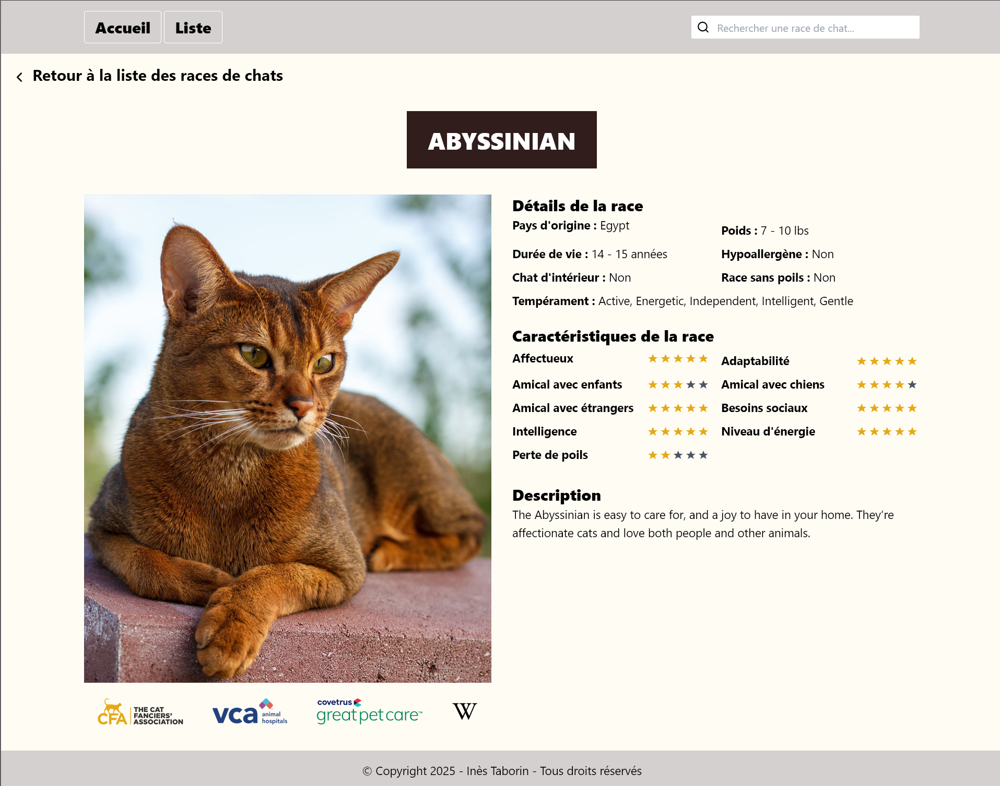

# 🐾 Projet API Chats – React & Tailwind

Ce projet est une mini-application développée avec **React** et **Tailwind CSS**, permettant d'afficher des images et informations sur des chats aléatoires via une API publique. C'est un projet simple et visuel pour expérimenter les appels API (`fetch`) et la mise en page avec Tailwind.

## 🎯 Objectif du projet

- Consommer une API externe (`The Cat API`)
- Afficher dynamiquement une image de chat
- Recharger l’image sur clic
- Structurer un projet React moderne avec composants
- Styliser rapidement avec Tailwind CSS

## 🖼️ Aperçu




## ⚙️ Stack technique

- ⚛️ **React**
- 🎨 **Tailwind CSS**
- 🌐 **The Cat API** — [https://thecatapi.com/](https://thecatapi.com/)

## 🔄 Fonctionnalités

- Chargement d’une image de chat aléatoire à l’ouverture de la page
- Bouton pour rafraîchir l’image avec un nouveau chat
- Responsive design rapide avec Tailwind

## 🚀 Lancer le projet en local

```bash
# 1. Cloner le repo
git clone https://github.com/ines-taborin/Projet-API-Chats.git
cd Projet-API-Chats

# 2. Installer les dépendances
npm install

# 3. Lancer le projet
npm run dev
